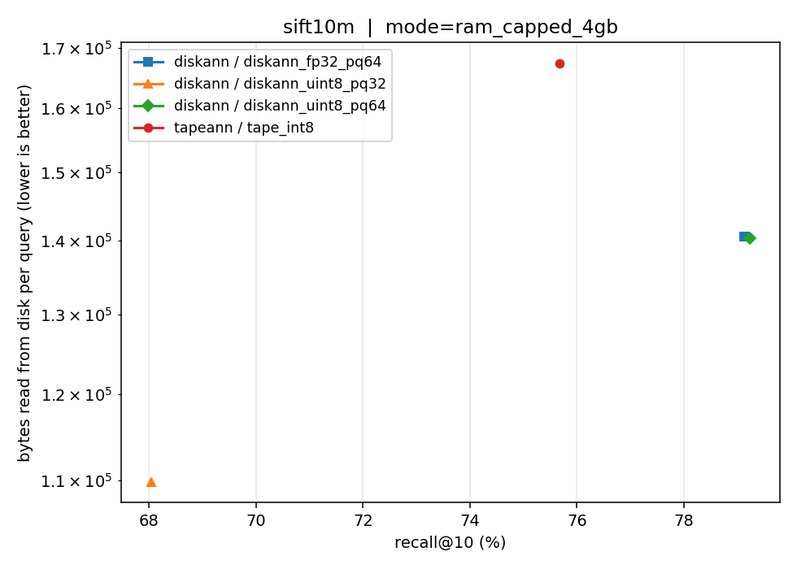
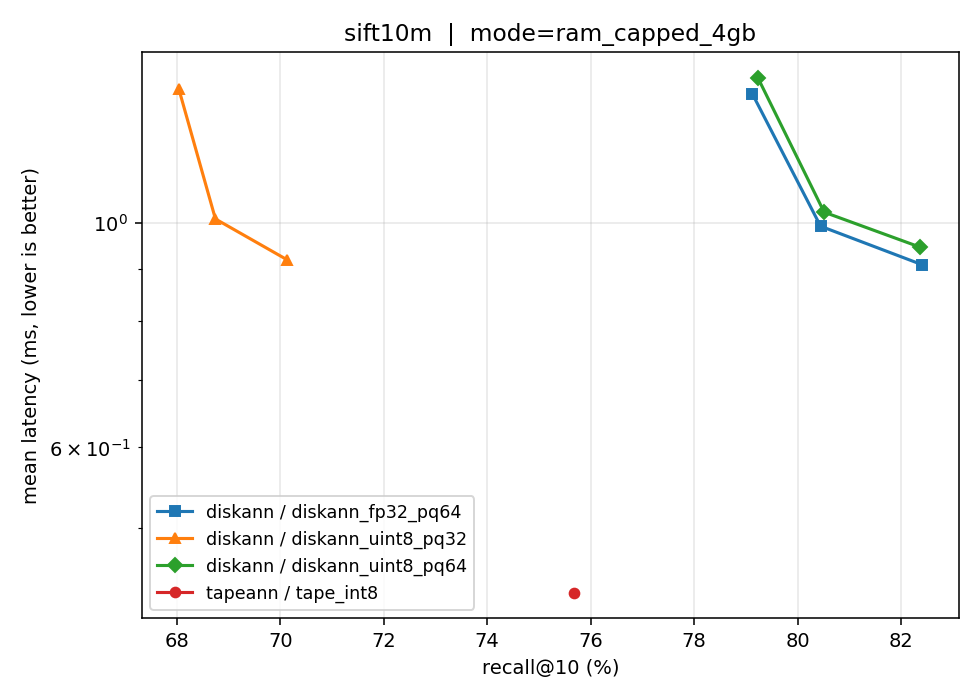
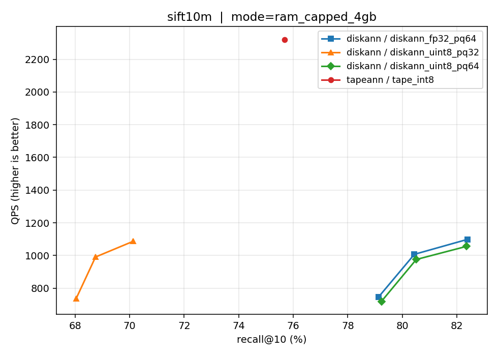

# TAPEANN vs DiskANN — benchmark report

## Environment
_env.txt missing — run bench/prep/env_capture.sh_

## Build costs
| algo | variant | dataset | wall_s | peak_rss_mb | idx_GB | built_at |
|---|---|---|---|---|---|---|
| tapeann | tape_int8 | sift10m | 0.0 | 0.0 | 1.67 | 2026-04-19T15:30:44 |
| tapeann | tape_int8 | sift10m | 1623.54 | 11635.9 | 6.79 | 2026-04-19T15:58:06 |

## Head-to-head (matched bytes/vector)
`tape_int8` vs `diskann_uint8_pq64` at fixed recall targets. Both systems store 1 byte per dimension in the vector store; other DiskANN variants are reported as reference only.

### `sift10m` · mode=`ram_capped_4gb`

| target | tape achieved | tape qps | tape ms | tape B/q | diskann achieved | diskann qps | diskann ms | diskann B/q | qps ratio (tape/diskann) |
|---|---|---|---|---|---|---|---|---|---|
| 85 | 88.353 | 1185.3515 | 0.8436 | 167385.1 | 82.363 | 1055.9172 | 0.9463 | 191786.6 | 1.12× |
| 90 | 88.353 | 1185.3515 | 0.8436 | 167385.1 | 90.859 | 483.1987 | 2.0688 | 179116.0 | 2.45× |
| 95 | 94.044 | 632.3854 | 1.5813 | 167372.4 | 95.198 | 725.8374 | 1.377 | 263791.8 | 0.87× |

### `sift10m` · mode=`warm`

| target | tape achieved | tape qps | tape ms | tape B/q | diskann achieved | diskann qps | diskann ms | diskann B/q | qps ratio (tape/diskann) |
|---|---|---|---|---|---|---|---|---|---|
| 85 | 88.353 | 1380.2198 | 0.7245 | 0.0 | 82.363 | 1596.9426 | 0.6255 | 152632.5 | 0.86× |
| 90 | 88.353 | 1380.2198 | 0.7245 | 0.0 | 90.859 | 591.9103 | 1.6887 | 175811.8 | 2.33× |
| 95 | 94.044 | 721.2124 | 1.3866 | 0.0 | 95.198 | 951.3641 | 1.0504 | 223764.9 | 0.76× |

## All operating points (closest to recall target)
Includes reference variants `diskann_fp32_pq64 (ref)` and `diskann_uint8_pq32 (ref)`.

### `sift10m` · mode=`ram_capped_4gb`

| target | algo | variant | achieved | latency_ms | qps | bytes/q | ios/q | params |
|---|---|---|---|---|---|---|---|---|
| 85.0 | diskann | diskann_fp32_pq64 (ref) | 82.401 | 0.9093 | 1098.8352 | 191533.9 | 30.5555 | {"L": 10, "W": 4} |
| 85.0 | diskann | diskann_uint8_pq32 (ref) | 85.909 | 2.0393 | 490.1893 | 148289.5 | 27.8545 | {"L": 20, "W": 1} |
| 85.0 | diskann | diskann_uint8_pq64 | 82.363 | 0.9463 | 1055.9172 | 191786.6 | 30.616 | {"L": 10, "W": 4} |
| 85.0 | tapeann | tape_int8 | 88.353 | 0.8436 | 1185.3515 | 167385.1 | 25.0 | {"probes": 25} |
| 90.0 | diskann | diskann_fp32_pq64 (ref) | 90.878 | 2.0527 | 486.9724 | 179127.1 | 27.482 | {"L": 20, "W": 1} |
| 90.0 | diskann | diskann_uint8_pq32 (ref) | 92.131 | 2.7108 | 368.7844 | 187658.2 | 37.4256 | {"L": 30, "W": 1} |
| 90.0 | diskann | diskann_uint8_pq64 | 90.859 | 2.0688 | 483.1987 | 179116.0 | 27.5218 | {"L": 20, "W": 1} |
| 90.0 | tapeann | tape_int8 | 88.353 | 0.8436 | 1185.3515 | 167385.1 | 25.0 | {"probes": 25} |
| 95.0 | diskann | diskann_fp32_pq64 (ref) | 95.183 | 1.3349 | 748.7001 | 263731.6 | 48.1911 | {"L": 30, "W": 4} |
| 95.0 | diskann | diskann_uint8_pq32 (ref) | 96.579 | 4.0976 | 243.9958 | 267451.2 | 56.9678 | {"L": 50, "W": 1} |
| 95.0 | diskann | diskann_uint8_pq64 | 95.198 | 1.377 | 725.8374 | 263791.8 | 48.2827 | {"L": 30, "W": 4} |
| 95.0 | tapeann | tape_int8 | 94.044 | 1.5813 | 632.3854 | 167372.4 | 50.0 | {"probes": 50} |

### `sift10m` · mode=`warm`

| target | algo | variant | achieved | latency_ms | qps | bytes/q | ios/q | params |
|---|---|---|---|---|---|---|---|---|
| 85.0 | diskann | diskann_fp32_pq64 (ref) | 82.401 | 0.5991 | 1667.1091 | 152415.8 | 30.5555 | {"L": 10, "W": 4} |
| 85.0 | diskann | diskann_uint8_pq32 (ref) | 85.909 | 1.6652 | 600.2506 | 176839.1 | 27.8545 | {"L": 20, "W": 1} |
| 85.0 | diskann | diskann_uint8_pq64 | 82.363 | 0.6255 | 1596.9426 | 152632.5 | 30.616 | {"L": 10, "W": 4} |
| 85.0 | tapeann | tape_int8 | 88.353 | 0.7245 | 1380.2198 | 0.0 | 25.0 | {"probes": 25} |
| 90.0 | diskann | diskann_fp32_pq64 (ref) | 90.878 | 1.6695 | 598.7308 | 175525.9 | 27.482 | {"L": 20, "W": 1} |
| 90.0 | diskann | diskann_uint8_pq32 (ref) | 92.131 | 2.3233 | 430.2744 | 215368.5 | 37.4256 | {"L": 30, "W": 1} |
| 90.0 | diskann | diskann_uint8_pq64 | 90.859 | 1.6887 | 591.9103 | 175811.8 | 27.5218 | {"L": 20, "W": 1} |
| 90.0 | tapeann | tape_int8 | 88.353 | 0.7245 | 1380.2198 | 0.0 | 25.0 | {"probes": 25} |
| 95.0 | diskann | diskann_fp32_pq64 (ref) | 95.183 | 1.0109 | 988.4741 | 223449.9 | 48.1911 | {"L": 30, "W": 4} |
| 95.0 | diskann | diskann_uint8_pq32 (ref) | 96.579 | 3.675 | 272.05 | 293641.8 | 56.9678 | {"L": 50, "W": 1} |
| 95.0 | diskann | diskann_uint8_pq64 | 95.198 | 1.0504 | 951.3641 | 223764.9 | 48.2827 | {"L": 30, "W": 4} |
| 95.0 | tapeann | tape_int8 | 94.044 | 1.3866 | 721.2124 | 0.0 | 50.0 | {"probes": 50} |

## Pareto plots

